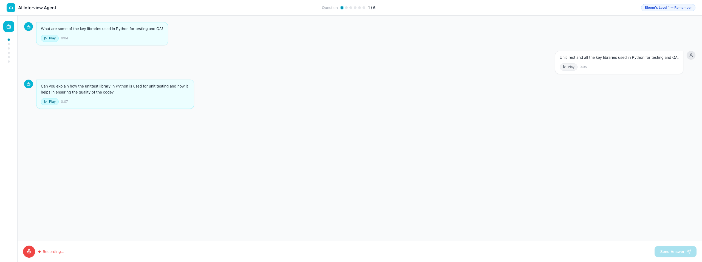
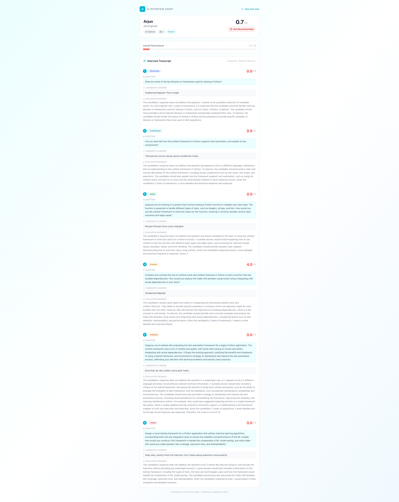
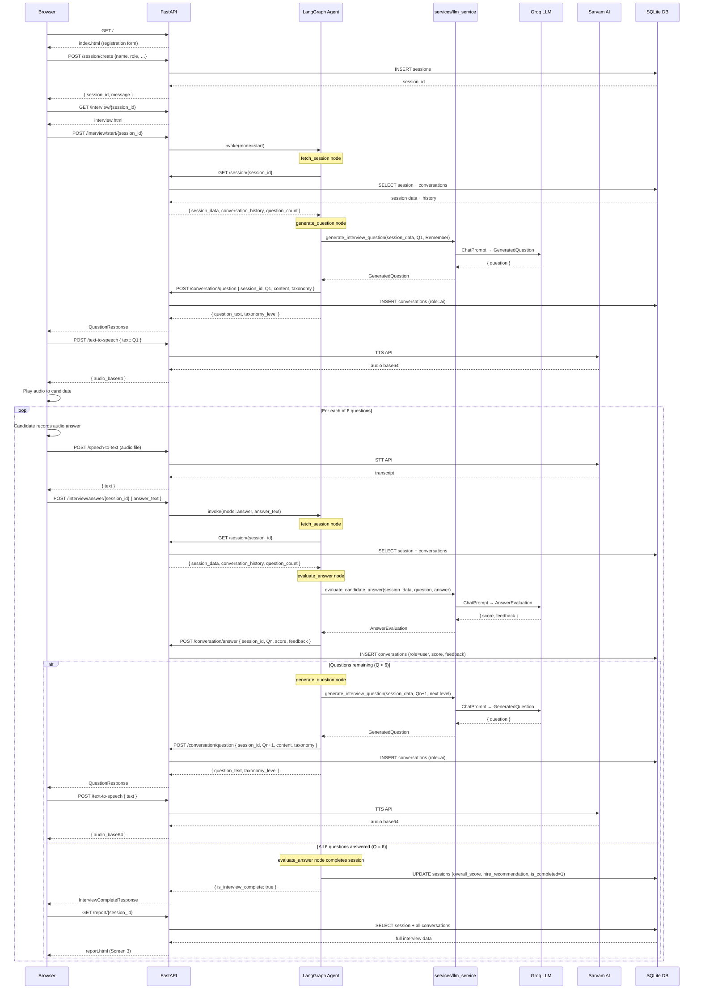
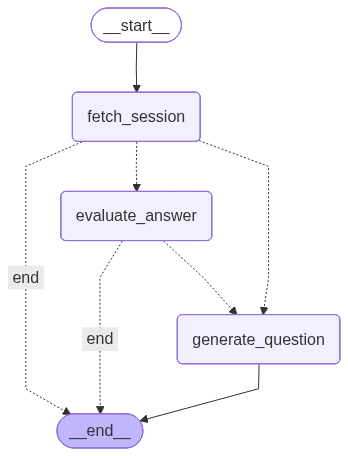

# AI Interview Agent

An automated technical interview system built with **LangGraph**, **Groq LLM**, and **Sarvam AI** TTS/STT. The agent conducts structured interviews using **Bloom's Taxonomy**, progressively increasing cognitive complexity across 6 questions.

---

## Tech Stack

| Layer | Technology |
|---|---|
| Package manager | `uv` |
| API framework | FastAPI |
| AI agent | LangGraph + LangChain |
| LLM | Groq (`llama-3.3-70b-versatile`) with structured output |
| Text-to-Speech | Sarvam AI |
| Speech-to-Text | Sarvam AI |
| Database | SQLite (via `aiosqlite`) |
| UI | Jinja2 templates + inline Tailwind CSS |

---

## Project Structure

```
ai-interview-agent/
├── main.py                    # FastAPI app entry point
├── config.py                  # Environment variable loader (Pydantic Settings)
├── constants.py               # Static values: taxonomy levels, roles, thresholds
├── logger.py                  # Custom coloured logger (no timestamp)
├── generate_graph.py          # Saves the agent flow diagram as agent_flow.png
├── pyproject.toml             # uv project definition
├── .env.example               # Template for environment variables
│
├── database/
│   ├── connection.py          # SQLite table initialisation (synchronous)
│   └── models.py              # Async CRUD operations (sessions, conversations, errors)
│
├── schemas/
│   ├── session.py             # Pydantic I/O models for session endpoints
│   ├── conversation.py        # Pydantic I/O models for conversation endpoints
│   ├── interview.py           # Pydantic I/O models for interview endpoints
│   └── agent.py               # Structured output schemas for LLM responses
│
├── services/
│   └── llm_service.py         # Groq LLM calls — generate question & evaluate answer
│
├── agent/
│   ├── state.py               # LangGraph shared state (TypedDict)
│   ├── graph.py               # Graph topology + routing functions
│   └── nodes/
│       ├── fetch_session.py      # GET /session/{id} → load session + history
│       ├── generate_question.py  # LLM → next Bloom's question → POST /conversation/question
│       └── evaluate_answer.py    # LLM → score + feedback → POST /conversation/answer
│
├── api/
│   ├── session.py             # POST /session/create · GET /session/{id}
│   ├── conversation.py        # POST /conversation/question · /conversation/answer
│   ├── interview.py           # POST /interview/start/{id} · /interview/answer/{id}
│   ├── tts.py                 # POST /text-to-speech
│   ├── stt.py                 # POST /speech-to-text
│   └── report.py              # GET  /report/{id}
│
├── templates/
│   ├── base.html              # Shared layout + Tailwind CDN + Lucide icons
│   ├── index.html             # Screen 1 — Candidate registration
│   ├── interview.html         # Screen 2 — Live interview
│   └── report.html            # Screen 3 — Interview report
│
└── data/                      # SQLite database files (git-ignored)
```

---

## Database Schema

### `sessions`
| Column | Type | Description |
|---|---|---|
| session_id | TEXT PK | UUID generated at session creation |
| name | TEXT | Candidate's full name |
| job_role | TEXT | Target role |
| highest_qualification | TEXT | Education level |
| experience | TEXT | Work experience description |
| skills_set | TEXT | Comma-separated skills |
| overall_score | REAL | Final average score (0–10), set on completion |
| hire_recommendation | TEXT | Strongly Recommend / Recommend / Neutral / Not Recommended |
| is_completed | INTEGER | 0 = in progress, 1 = completed |
| timestamp | TEXT | ISO 8601 UTC creation time |

### `conversations`
| Column | Type | Description |
|---|---|---|
| id | INTEGER PK | Auto-increment |
| session_id | TEXT FK | Owning session |
| question_no | INTEGER | 1-based question index |
| role | TEXT | `ai` (question) or `user` (answer) |
| content | TEXT | Question or answer text |
| taxonomy_level | TEXT | Bloom's level name — AI entries only |
| score | REAL | 0–10 score — user entries only |
| evaluation_feedback | TEXT | Per-answer narrative — user entries only |
| timestamp | TEXT | ISO 8601 UTC |

### `errors`
| Column | Type | Description |
|---|---|---|
| id | INTEGER PK | Auto-increment |
| session_id | TEXT FK | Associated session (nullable) |
| error_type | TEXT | Short classification, e.g. `TTSAPIError` |
| error_message | TEXT | Human-readable description |
| stack_trace | TEXT | Full Python traceback |
| timestamp | TEXT | ISO 8601 UTC |

---

## Bloom's Taxonomy Interview Structure

| Q# | Level | Cognitive Goal |
|---|---|---|
| 1 | **Remember** | Recall facts, definitions, terminology |
| 2 | **Understand** | Explain concepts in own words |
| 3 | **Apply** | Use knowledge in practical scenarios |
| 4 | **Analyze** | Break down problems, compare approaches |
| 5 | **Evaluate** | Justify decisions, critique trade-offs |
| 6 | **Create** | Design novel solutions end-to-end |

---

## Screenshots

### Screen 1 — Candidate Registration


### Screen 2 — Live Interview


### Screen 3 — Interview Report


---

## Sequence Diagram


<details>
<summary>View as Mermaid source</summary>



</details>

---

## Getting Started

### 1. Clone the repository

```bash
git clone <repo-url>
cd ai-interview-agent
```

### 2. Install dependencies

```bash
uv sync
```

`uv sync` reads `pyproject.toml`, creates a `.venv` automatically, and installs all dependencies in one step. No manual `venv` creation or `pip install` needed.

### 3. Configure environment variables

```bash
cp .env.example .env
# Edit .env and fill in your GROQ_API_KEY and SARVAM_API_KEY
```

### 4. Run the application

```bash
uv run python main.py
```

`uv run` executes the command inside the project's virtual environment without you needing to activate it first.

Open [http://localhost:8000](http://localhost:8000) in your browser.

---

## API Reference

| Method | Endpoint | Description |
|---|---|---|
| `GET` | `/` | Registration page (Screen 1) |
| `POST` | `/session/create` | Create a new candidate session → returns `session_id` |
| `GET` | `/session/{session_id}` | Fetch session data + conversation history (used by agent) |
| `POST` | `/conversation/question` | Save an AI-generated question (called by agent node) |
| `POST` | `/conversation/answer` | Save a candidate's evaluated answer (called by agent node) |
| `GET` | `/interview/{session_id}` | Interview page (Screen 2) |
| `POST` | `/interview/start/{session_id}` | Start interview, receive first question |
| `POST` | `/interview/answer/{session_id}` | Submit answer, receive next question or completion signal |
| `POST` | `/text-to-speech` | Convert question text to audio (Sarvam AI) |
| `POST` | `/speech-to-text` | Transcribe candidate audio to text (Sarvam AI) |
| `GET` | `/report/{session_id}` | Interview report page (Screen 3) |

Interactive API docs: [http://localhost:8000/docs](http://localhost:8000/docs)

---

## Environment Variables

| Variable | Required | Default | Description |
|---|---|---|---|
| `GROQ_API_KEY` | Yes | — | Groq API key |
| `SARVAM_API_KEY` | Yes | — | Sarvam AI API key |
| `DATABASE_PATH` | No | `./data/interview.db` | SQLite file path |
| `APP_HOST` | No | `0.0.0.0` | Server host |
| `APP_PORT` | No | `8000` | Server port |
| `APP_DEBUG` | No | `true` | Enable hot-reload |
| `LOG_LEVEL` | No | `INFO` | Logging verbosity |

---

## LangGraph Agent Flow



```
START
  │
  ▼
fetch_session ──(error)──► END
  │
  ├──(mode=start)──► generate_question ──► END
  │
  └──(mode=answer)─► evaluate_answer
                       │
                       ├──(Q < 6)──► generate_question ──► END
                       │
                       └──(Q = 6)──────────────────────► END
                                    (marks session complete
                                     inside evaluate_answer)
```

The agent is **stateless per invocation** — each API call compiles a fresh graph run. All state is persisted in SQLite and reloaded at the start of every run via `GET /session/{session_id}`.

### Node responsibilities

| Node | What it does |
|---|---|
| `fetch_session` | Calls `GET /session/{id}` to load candidate profile + full conversation history |
| `generate_question` | Calls `services/llm_service` → Groq → saves question via `POST /conversation/question` |
| `evaluate_answer` | Calls `services/llm_service` → Groq → saves answer via `POST /conversation/answer`; on Q6 also updates session with overall score and hire recommendation |

### services/llm_service.py

All Groq LLM calls are centralised here so the agent nodes stay clean:

- `generate_interview_question(session_data, question_no, taxonomy, history_context, groq_api_key)` → `GeneratedQuestion`
- `evaluate_candidate_answer(session_data, question_text, answer_text, taxonomy_level, groq_api_key)` → `AnswerEvaluation`
